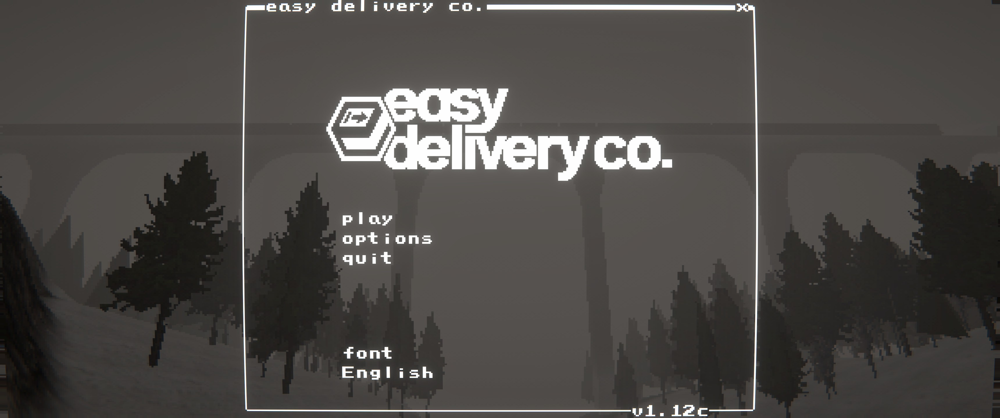
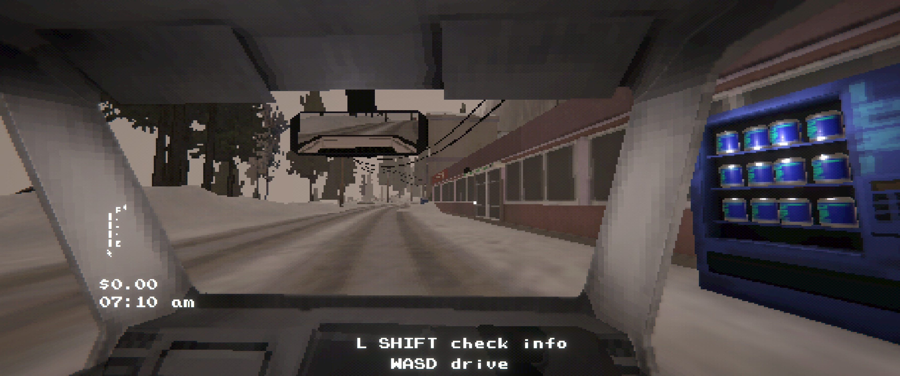
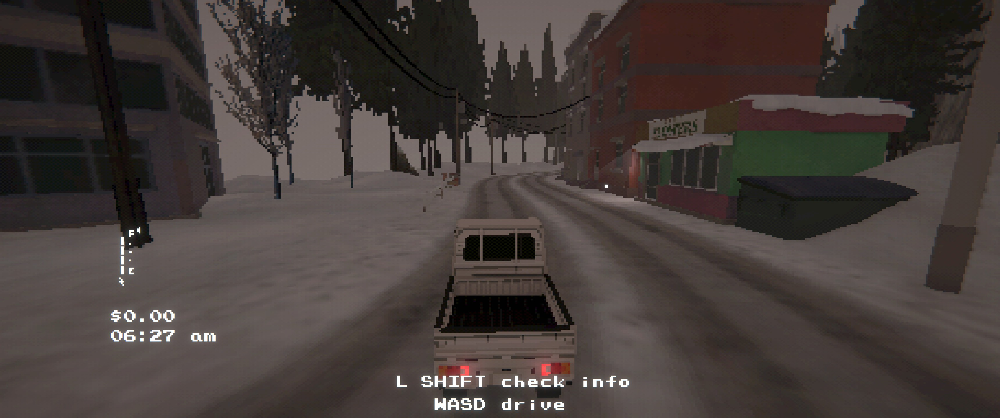
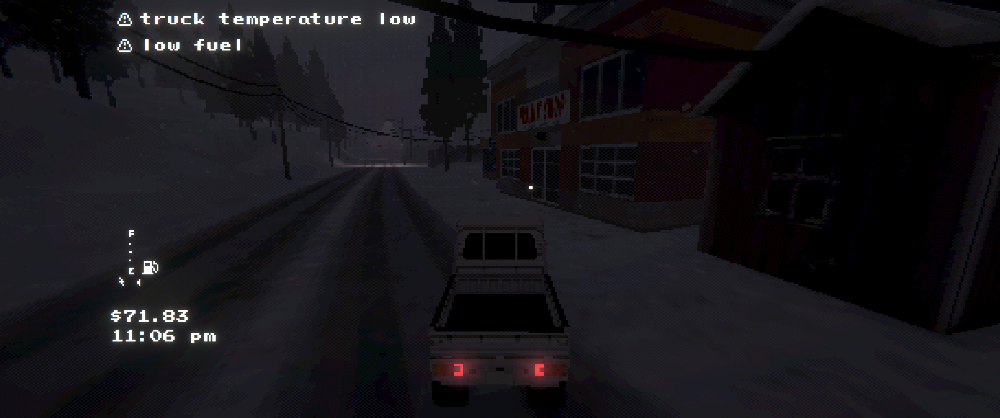
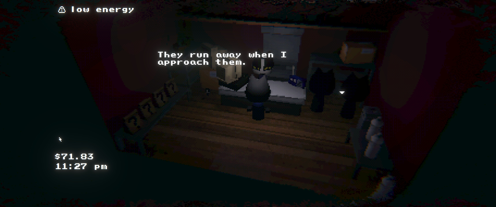
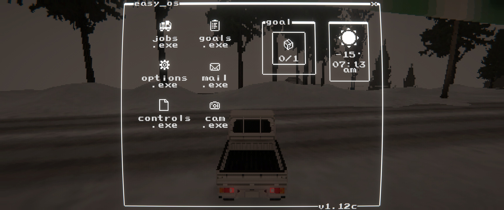
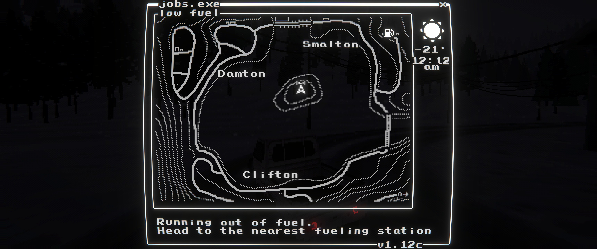

# Easy Delivery Co. - Ultrawide Support Mod

Ultrawide support via camera and UI overlay fixes for Easy Delivery Co. This mod unlocks viewport scaling for wide displays, keeps HUD elements readable, and ensures menus and transitions stretch cleanly across ultrawide aspect ratios.

## Features
- Unlocks camera viewports for ultrawide displays
- Optional aspect ratio overrides for gameplay and menu cameras
- Scales menu, pause, and transition overlays to full width
- Keeps main UI elements at their intended ratio

## Screenshots

## Installation
- r2modman/Thunderstore: install and launch the game
- Manual: copy `EasyDeliveryCoUltrawide.dll` to `BepInEx/plugins/EasyDeliveryCoUltrawide/`

#### Configuration
- Config file: `BepInEx/config/shibe.easydeliveryco.ultrawide.cfg`
- `enable_mod`: enable/disable the mod
- `enable_hud_fix`: enable/disable HUD scaling and positioning fixes
- `aspect_ratio`: `auto` (display), `window`, `21:9`, `32:9`, `2.39`

## Planned Features
- Add menu in-game for FOV settings

## Build
- Build: `dotnet build EasyDeliveryCoUltrawide/EasyDeliveryCoUltrawide.csproj -c Release`
- Package: `powershell -NoProfile -ExecutionPolicy Bypass -File scripts/package.ps1 -Version 1.0.5`
